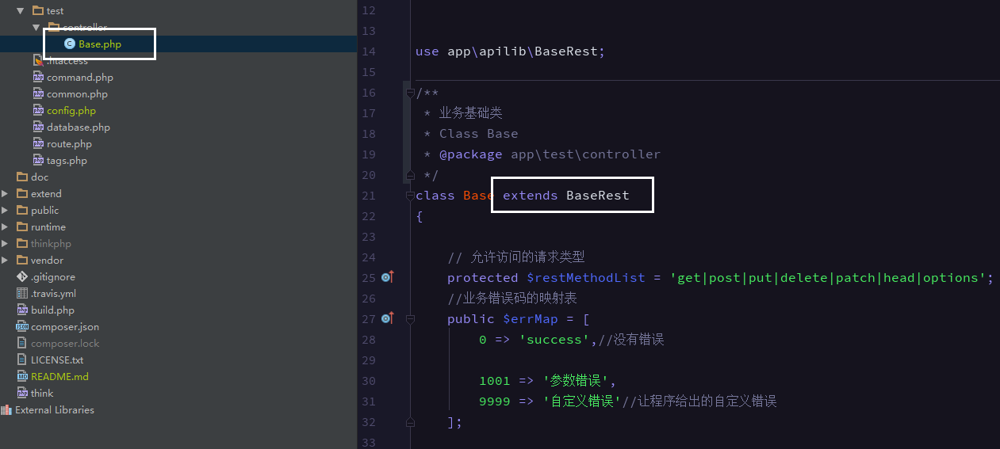
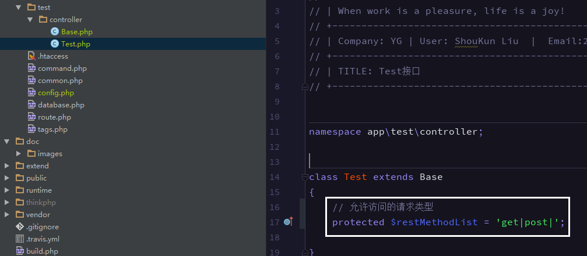
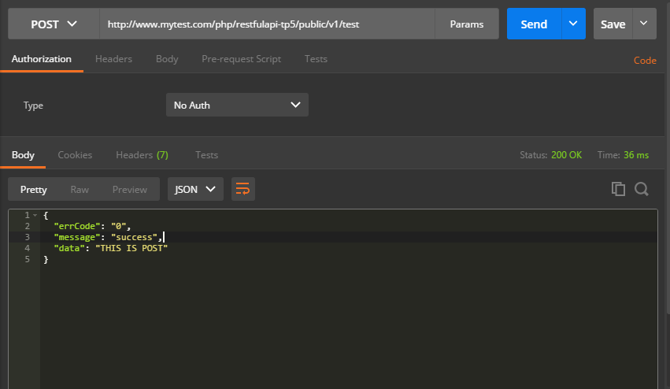
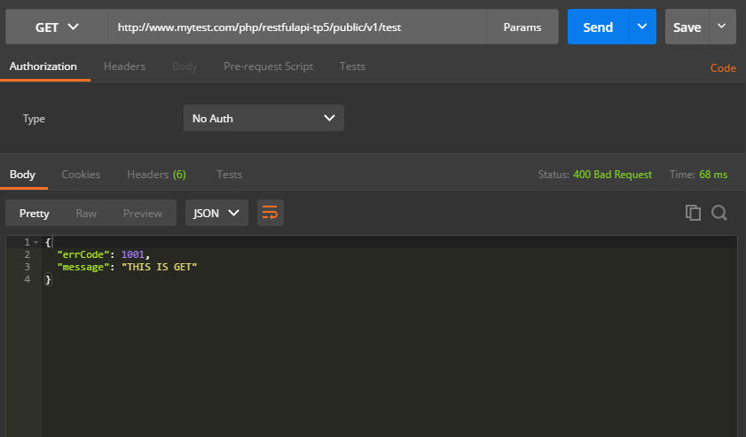
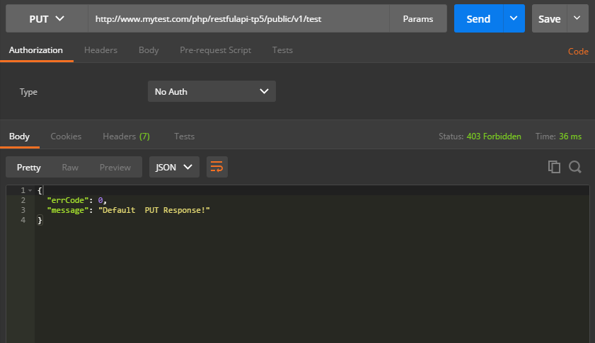
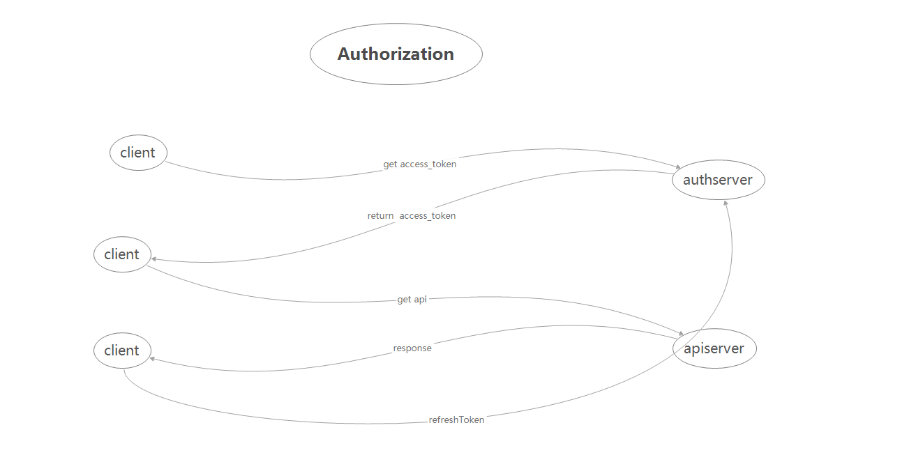
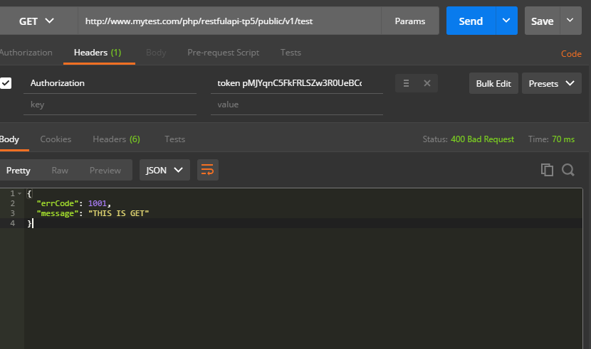

Restful Api 
===============
以restful api风格处理请求，每个接口对于一个控制器，method对应[method]Response方法响应
 
 
##相关依赖
 - [PHP5.4+]()
 - [ThinkPHP5.0](https://github.com/top-think/think) 基础框架
 - [RandomLib](https://github.com/ircmaxell/RandomLib) 用于生成随机数和字符串的库
 

## 目录结构


~~~
apilib
├─application           应用目录
│  ├─apilib             apilib目录
│  │  ├─Common.php      公共类库基础Rest
│  │  ├─BaseRest.php    Restful风格基础类
│  │  ├─BaseAuth.php    认证基础类
│  │  ├─Behavior.php    行为类
│  │  └─ ...            

~~~


##安装

```
git clone 
    
composer install
```
## 使用

 1. 新建测试模块 test
 2. 创建业务基础类继承 BaseRest
 



 3. 创建一个Test接口并设置该接口的允许请求类型 
 


 4. Test控制器实现这两个响应
 

```
    /**
     * get的响应
     * @param Request $request
     * @return mixed
     */
    public function getResponse(Request $request)
    {
        return  $this->sendError(1001,'THIS IS GET',400);
    }

    /**
     * post的响应
     * @param Request $request
     * @return mixed
     */
    public function postResponse(Request $request)
    {
        return  $this->sendSuccess('THIS IS POST');
    }

```
 
 4. 设置路由 action需要填写init(会进行调用)
 
```
 '[v1]' => [
        'test' => ['test/Test/init',],
    ],
```
 5. 请求获得响应
 
 
 - POST的响应
 
 



 - GET的响应
 
 

 
 - 其让未允许的响应
 
 



## 开启权限
  认证模式


> 1. 客户端向认证服务器发起请求
> 2. 认证服务器确认用户返回access_token(客户端存储,并且有过期时间为7200s)
> 3. 客户端向携带access_token向接口服务器发起请求
> 4. 接口服务器认证access_token，响应
> 5. access_token过期可以向认证服务器refreshToken

本代码认证服务器和接口服务器共用,服务器存储access_token信息采用缓存;


 1. 新建一个继承 BaseAuth 的控制器
 
 


 2. 添加路由
 
```
  //获取认证信息
    'accessToken' => 'test/AccessToken/accessToken',
    'refreshToken' => 'test/AccessToken/refreshToken',
```

 3.添加配置 认证总开关
 
```
   'api_auth' => true,//是否开启API认证
```

 4.控制器开关 
  - 基础类设置开启
  
```
    //是否开启权限认证
    public    $apiAuth = true;
```
 - 实际接口可覆盖
    
```
    public    $apiAuth = false;
```


|配置(api_auth)|类($apiAuth)|效用|
|:---:|:---:|:---:|
|true|true|认证开启|
|true|false|认证关闭|
|false|false|认证关闭|
|false|true|认证关闭|


### 默认用户

|名称|keys|value|必须|
|:---:|:---:|:---:|:---:|
|客户端账户名称|client_name|test|false|
|客户端账户id|client_id|11111111|true|
|加密秘钥|secret|qwekjznc120cnsdkjhad|true|
|权限列表|authorization|test/Test/init,|true|

可以根据 $client_id 改写


```
 /**
     * 获取客户端信息
     * @param $client_id 客户端ID
     * @return array
     */
    public function getClient($client_id)
    {
        return [
            'client_name' => 'test',//客户端账户名称
            'client_id' => '11111111',//客户端账户id
            'secret' => 'qwekjznc120cnsdkjhad',  //加密秘钥
            'authorization_list' => 'test/Test/init,',//权限列表
        ];
    }

```


### 获取[access_token](host/accessToken) 和  [refresh_token_token](host/refreshToken)
地址是配置地址


|参数|必须|备注|默认值|
|:---:|:---:|:---:|:---:|
|client_id|true|客户端ID||
|time|true|请求时间||
|sign|true|签名md5(md5(client_id + time + secret))||
|grant_type|false|认证类型| client_credentials 或 refresh_token |


```
accessToken?client_id=11111111&time=1487664463&sign=709639d7a24142d279ac34d8458ad5af&grant_type=client_credentials
```
 
 

### 请求接口 


headers  添加 "Authorization":"token [上一步获得的access_token]()"
  



## 开发文档参考


 - [ThinkPHP5完全开发手册](http://www.kancloud.cn/manual/thinkphp5)
 - [restfulApi设计指南](http://www.ruanyifeng.com/blog/2014/05/restful_api.html)
 - [OAuth 2.0](http://www.ruanyifeng.com/blog/2014/05/oauth_2_0.html)
 
 

## 开发工具推荐
 - IDE PHPSTORM
 - 模拟请求 Postman


