Dawn-Api 
===============

[Toc]

## 说明
thinkphp5编写的restful风格的API，集API请求处理，权限认证，自动生成文档等功能；

 - restful风格处理请求
 > 每个接口对于一个控制器，method对应[method]方法响应

 - 权限认证
 > Basic,Oauth Client Credentials Grant
 
 - 文档生成
 > 简洁，优雅，不需要额外的文档工具;
 
 
## 安装
- 如果想在你的TP5项目中使用,那么可以直接使用
```
composer require liushoukun/dawn-api
```
- 如果是新项目先要创建tp5项目,然后再require

```
composer create-project topthink/think api  --prefer-dist
composer require liushoukun/dawn-api
```
- 如果要使用生成文档 需要在public/static/ 下 安装hadmin
```
cd /public/static/
git clone  hhttps://git.oschina.net/liushoukun/hadmin.git
```

## 使用

 1. 新建demo 模块
 2. 创建业务基础类 Base 继承 Api 
 
 3. 创建一个用户接口 User 继承 Base
 
 4. 添加路由 action需要填写restful(会进行调用)
 > /v1/user 
```php
  '[v1]' => [
        'user' => ['demo/User/restful',], //用户模块接口
    ],
```


 5. 设置允许访问的方式

```php
// 允许访问的请求类型
public $restMethodList ='get|post|delete';
```

- 获取用户(get),post(新增用户)的相应方法 


```php
  /**
      * get
      *
      * @param Request $request
      * @return \think\Response|\think\response\Json|\think\response\Jsonp|\think\response\Redirect|\think\response\Xml
      */
     public function get(Request $request)
     {
         // todo find
         return $this->sendSuccess(['name' => 'dawn-api', 'id' => 1]);
     }
 
     /**
      * post
      *
      * @param Request $request
      * @return \think\Response|\think\response\Json|\think\response\Jsonp|\think\response\Xml
      */
     public function post(Request $request)
     {
         //todo create
         return $this->sendError(400, '用户名不能为空');
     }    
```

 
 4. 请求接口
 
  - GET的请求(获取用户信息)
  
  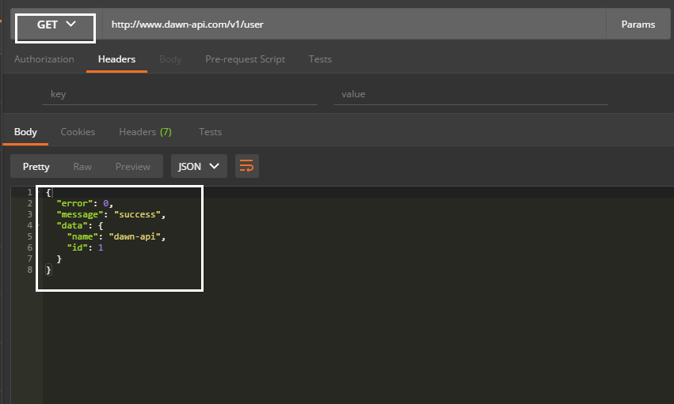
 
 - POST的请求(添加用户)
 
  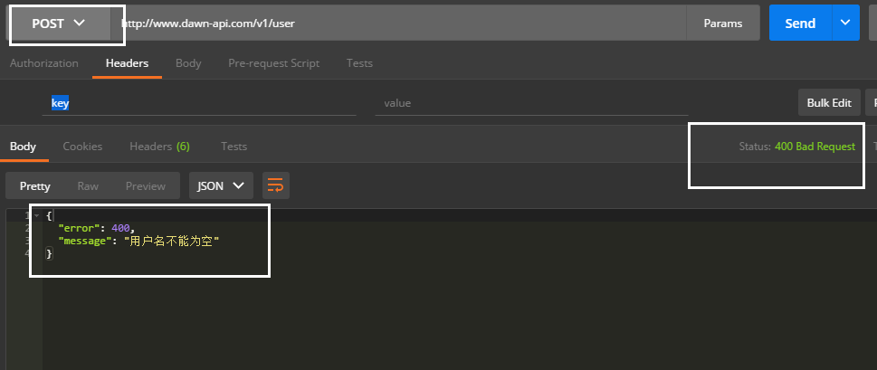

 - PUT 让未允许的响应
 
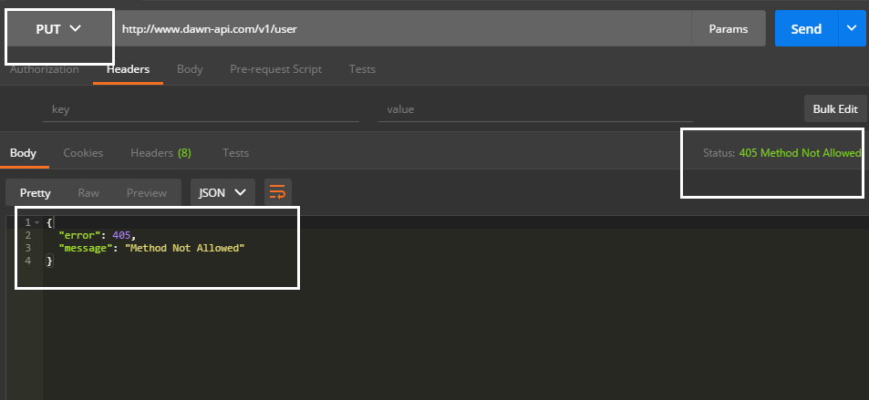

 - DELETE 可以方法问题，但没有编写方法执行 _empty方法,如有需要可改写
 
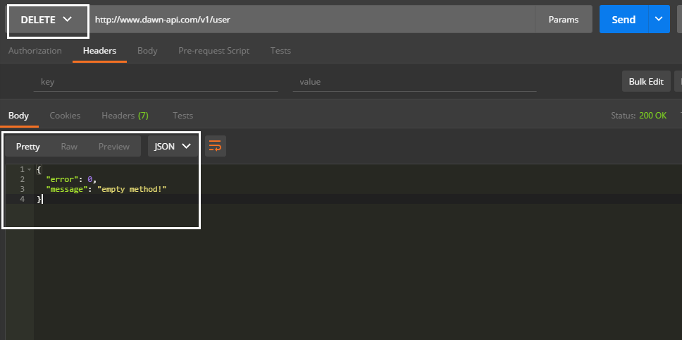

## 开启授权认证

 1.添加配置 认证总开关
 
```
 'api_auth' => true,  //是否开启授权认证
```

 2.权限类 实现AuthContract 接口 
 
  -  authenticate 接口认证返回true则通过，否则不通过
  
  - getUser 获取用户信息，Api控制可以调用
```php
self::$app['auth']->getUser();
```

```php
 /**
     * 认证授权通过客户端信息和路由等
     * 如果通过返回true
     * @param Request $request
     * @return bool
     */
    public function authenticate(Request $request)
    {
        // TODO: Implement authenticate() method.
        return true;
    }

    /**
     * 获取用户信息 接口里可以直接获取用户信息
     * @return mixed
     */
    public function getUser()
    {
       return ['app_id'=>'111','name'=>'dawn-api'];
    }

```

 3. 接口类开启授权认证
  
```php
//是否开启授权认证
public    $apiAuth = true;
```

|配置(api_auth)|类($apiAuth)|效用|
|:---:|:---:|:---:|
|true|true|认证开启|
|true|false|认证关闭|
|false|false|认证关闭|
|false|true|认证关闭|

 4. 配置验证类
```php
   'auth_class' => \app\demo\auth\Auth::class, //授权认证类
```


5. 改写get方法

```php
    /**
     * get
     *
     * @param Request $request
     * @return \think\Response|\think\response\Json|\think\response\Jsonp|\think\response\Redirect|\think\response\Xml
     */
    public function get(Request $request)
    {
        $user = self::$app['auth']->getUser();
        // todo find
        return $this->sendSuccess(['name' => 'dawn-api', 'id' => 1, 'user' => $user]);
    }
```

> 可以获取到用户信息

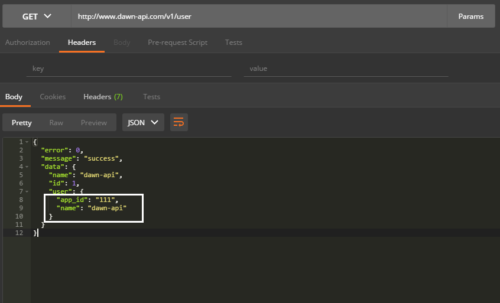

> 当然简单实现了Basic,Oauth Client Credentials Grant认证

- Oauth Client Credentials Grant
 1. 配置验证类
```php
   'auth_class' => \app\demo\auth\Auth::class, //授权认证类
```
 2. 获取access_token
 - 编写可访问的方法获取access_token
```php
namespace app\demo\controller;


use app\demo\auth\OauthAuth;
use think\Request;

class Auth
{
    public function accessToken()
    {
        $request = Request::instance();
        $OauthAuth = new OauthAuth();
        return $OauthAuth->accessToken($request);
    }

}
```
 - 配置路由
```php
 'accessToken'=>'demo/Auth/accessToken',//Oauth认证
```

按需改写获取客户端信息
```php

    /**
     * 返回用户信息
     * @return array
     */
    public static function getUserInfo()
    {
        return [
            'client_id' => '20882088',//app_id
            'secret' => 'nGk5R2wrnZqQ02bed29rjzax1QWRIu1O',
            'name' => 'test_client'];
    }
```

 - 请求获取
  /accessToken?client_id=20882088&secret=nGk5R2wrnZqQ02bed29rjzax1QWRIu1O
  或者
  /accessToken 
  headers Basic MjA4ODIwODg6bkdrNVIyd3JuWnFRMDJiZWQyOXJqemF4MVFXUkl1MU8=

 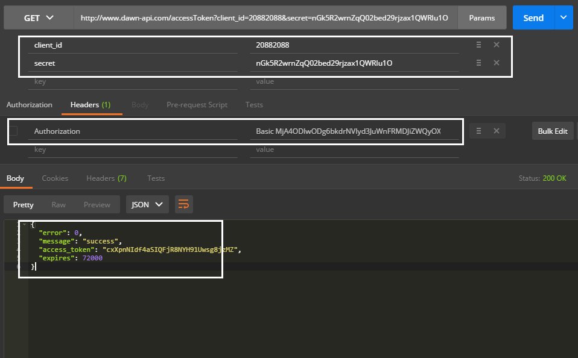

3.请求接口
 /v1/user?access_token=cxXpnNIdf4aSIQFjR8NYH91Uwsg8jzMZ

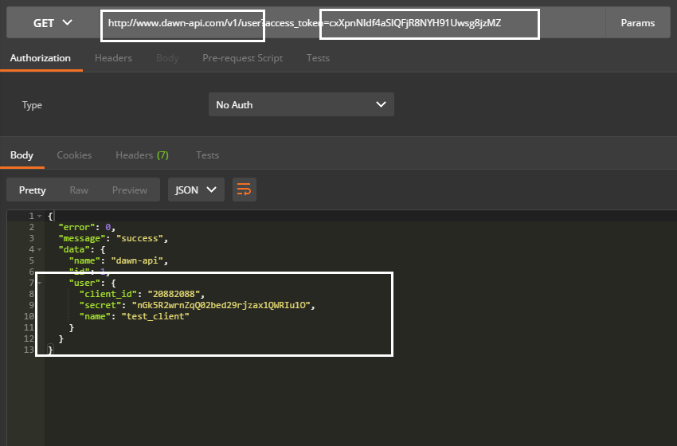

> 快捷方式利用postman
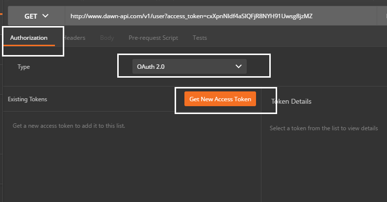
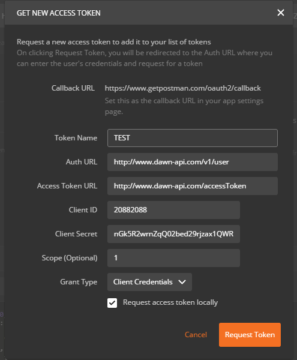
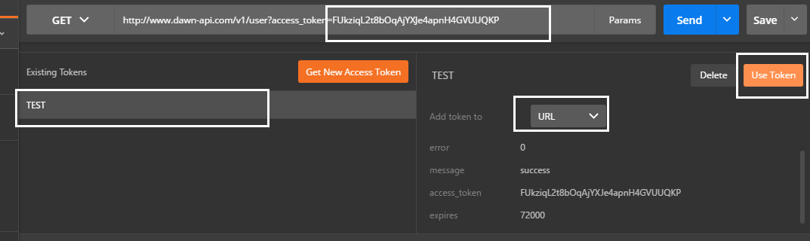
  
## 自动生成文档

1. 创建Doc文档显示控制器
    wiki 继承 DawnApi\facade\Doc;

2. 配置路由
```php
 'wiki'=>'demo/Wiki/index',//文档
```
 
3.配置文档显示目录

```php
    /**
     * 获取文档
     * @return mixed
     */
    public static function getApiDocList()
    {
        //todo 可以写配置文件或数据
        $apiList = Config::get('api_doc');
        return $apiList;
    }
```


>可以改写次方法以存储以无限级的方式，为了方便采用的是配置方式

tp5 增加额外配置  创建application/extra/api_doc.php 文件


```php
return [
    '1' => ['name' => '测试文档', 'id' => '1', 'parent' => '0', 'class'=>'','readme' =>''],//下面有子列表为一级目录
    '2' => ['name' => '获取权限', 'id' => '2', 'parent' => '1', 'class'=>'','readme' => '/doc/md/auth.md'],//没有接口的文档，加载markdown文档
    '3' => ['name' => '用户接口', 'id' => '3', 'parent' => '1', 'readme' => '','class'=>\app\test\controller\User::class],//User接口文档
];
```
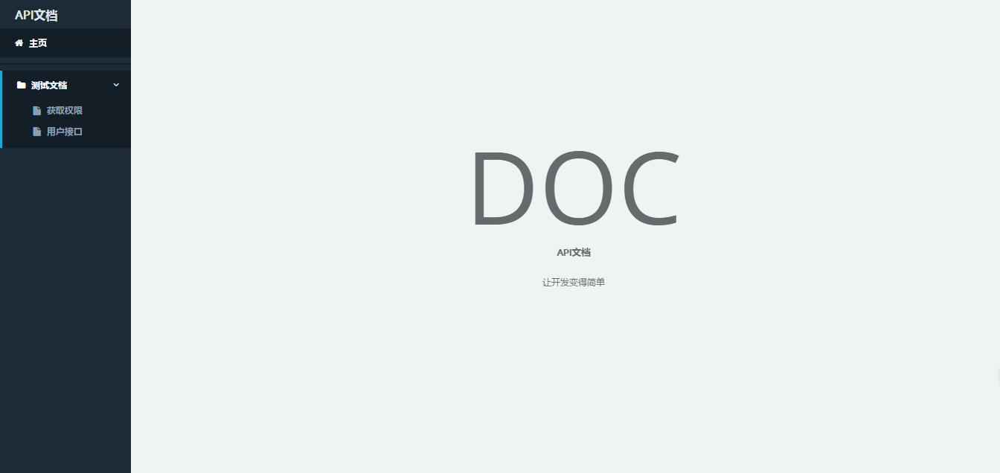

|参数|必须|备注|作用|
|:---:|:---:|:---:|:---:|
|name|true|接口列表名称|显示列表名称|
|id|true|主键|生成列表所用|
|parent|true|生成列表所用|
|class|true|接口位置|用于生成具体接口文档|
|readme|true|markdown|可以生成没有接口的文档，比如一些说明 module和controller为空,readme填文档路径|


3.具体接口文档配置


- 接口描述部分(类文件的注释)

```php
/**
 * Class User
 * @title 用户接口
 * @url /v1/user
 * @desc  有关于用户的接口
 * @version 1.0
 * @readme /doc/md/user.md
 */
class User extends Base{}
```


|参数|必须|备注|作用|
|:---:|:---:|:---:|:---:|
|title|true|接口标题|显示列表名称|
|url|true|请求地址|用户显示|
|desc|true|接口描述|显示描述|
|version|false|版本号|版本号|
|readme|false|markdown文档|可以编写信息文档|


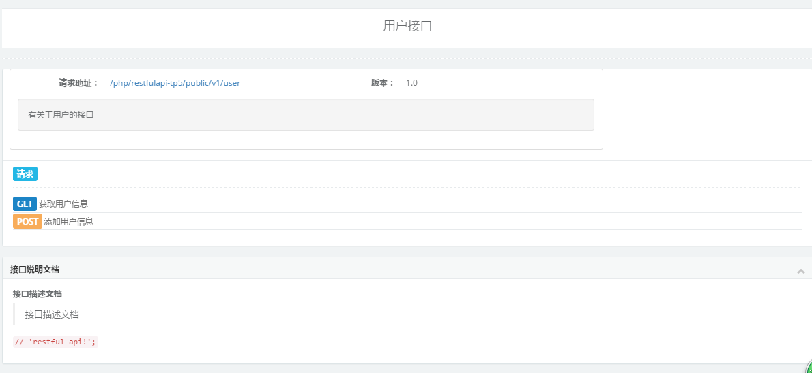


- 具体接口文档

 1. 接口描述信息(注释填写)

```php
       /**
        * @title 获取用户信息
        * @desc 获取用户信息
        * @readme /doc/md/method.md
        */
      public function getResponse(\think\Request $request){}

```


|参数|必须|备注|作用|
|:---:|:---:|:---:|:---:|
|title|true|接口标题|显示列表名称|
|desc|true|接口描述|显示描述|
|readme|false|markdown文档|可以编写信息文档|

   2.请求参数
   
   
```php
    /**
     * 参数规则
     * @name 字段名称
     * @type 类型
     * @require 是否必须
     * @default 默认值
     * @desc 说明
     * @range 范围
     * @return array
     */
    public static function getRules()
    {
        $rules = [
                //共用参数
                'all'=>[
                    'time'=> ['name' => 'time', 'type' => 'int', 'require' => 'true', 'default' => '', 'desc' => '时间戳', 'range' => '',]
                ],

                'get'=>[
                    'id' => ['name' => 'id', 'type' => 'int', 'require' => 'true', 'default' => '', 'desc' => '用户id', 'range' => '',]
                ],
                'post'=>[
                    'username' => ['name' => 'username', 'type' => 'string', 'require' => 'true', 'default' => '', 'desc' => '用户名', 'range' => '',],
                    'age' => ['name' => 'age', 'type' => 'int', 'require' => 'true', 'default' => '18', 'desc' => '年龄', 'range' => '0-200',],
                ]
        ];
        //合并父级类参数
        return array_merge(parent::getRules(),$rules);
    }
```


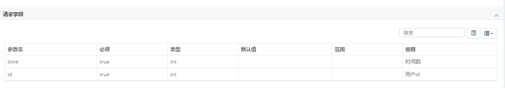
  

   3. 返回参数(注释填写)
   
   
```php
     * @return int id ID
     * @return string username 错误信息
     * @return int age 年龄
```


|参数|必须|备注|
|:---:|:---:|:---:|
|第一个参数|true|类型|
|第二个参数|true|参数名|
|第三个参数|true|参数说明|


>类型填写规则


```php
'string'    => '字符串',
'int'       => '整型',
'float'     => '浮点型',
'boolean'   => '布尔型',
'date'      => '日期',
'array'     => '数组',
'fixed'     => '固定值',
'enum'      => '枚举类型',
'object'    => '对象',
```
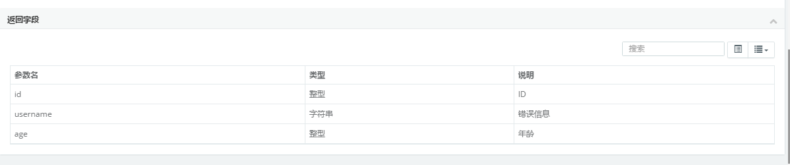
  
整体效果
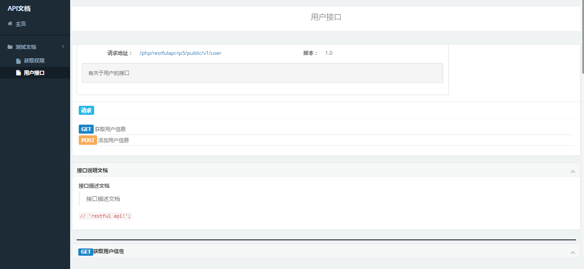
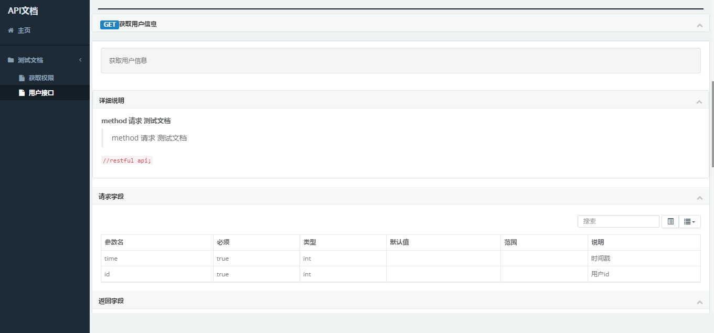
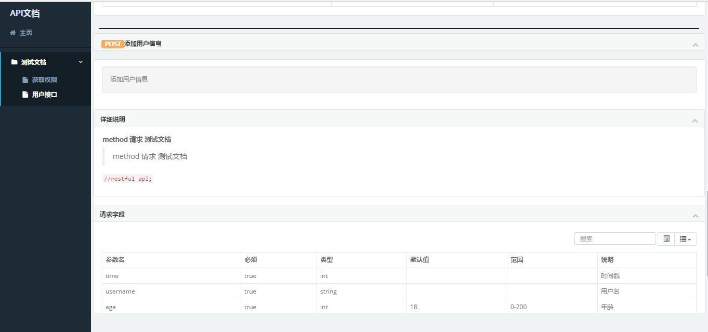
 

  


## 开发文档参考

 - [ThinkPHP5完全开发手册](http://www.kancloud.cn/manual/thinkphp5)
 - [restfulApi设计指南](http://www.ruanyifeng.com/blog/2014/05/restful_api.html)
 - [OAuth 2.0](http://www.ruanyifeng.com/blog/2014/05/oauth_2_0.html)
 
 

## 开发工具推荐
 - IDE PHPSTORM
 - 模拟请求 Postman


